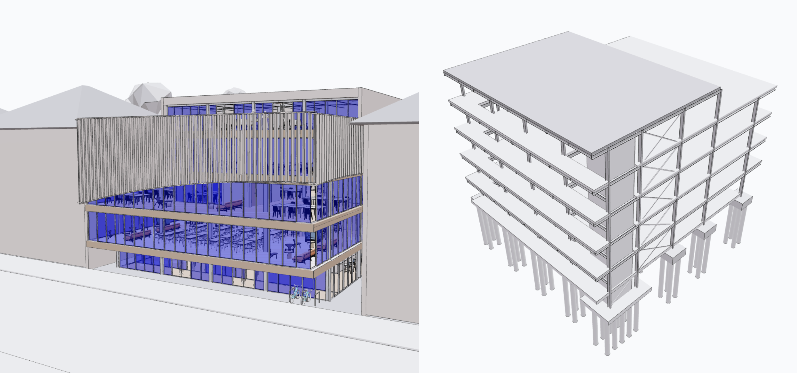
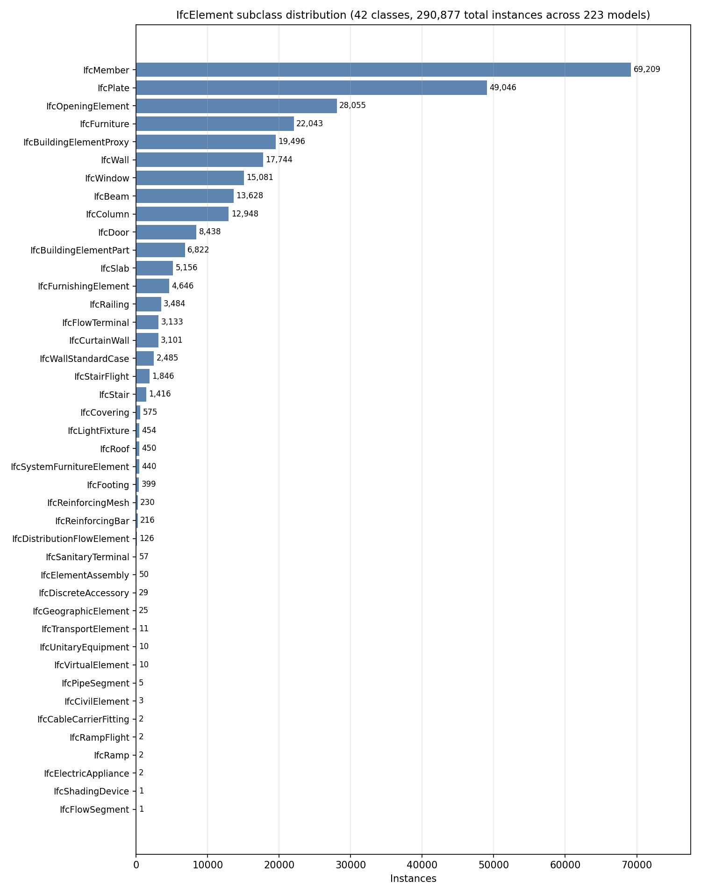

# GNI BIM Dataset

**224 anonymized IFC building models from the TUM Georg Nemetschek Institute – AI for the Built World / Chair of Computing in Civil and Building Engineering, Technical University of Munich — 208 single-discipline student submissions plus 16 models from 9 multi-discipline design projects.** We also include a CSV file with links to other online IFC model sources.



- **`2025_BIMfundamentals.zip`** — 208 single-discipline IFC of a specific shape building from the
  *BIM Fundamentals* master course (SS 2025).
- **`2026_BIMprojects.zip`** — 16 IFC from the *BIM Project* master
  course (WS 2025/26); 9 teams, 7 with paired architectural + structural
  models of the same building.
- **`other_online_BIM_model_resources.csv`** — 35 other online BIM sources.

We also open source the [IFC2StructuredData](https://github.com/ZijianWang-ZW/IFC2StructuredData), a tool that extracts BIM object attributes in csv and geometry in obj.

## Data collection

Both subsets come from student coursework at the TUM Georg Nemetschek Institute – AI for the Built World / Chair of Computing in Civil and Building Engineering, Technical University of Munich.

- [BIM Fundamentals (master course)](https://www.cee.ed.tum.de/ccbe/teaching/master/bimfundamentals/)
  — individual assignments, each student building a small-to-medium model
  in a commercial BIM tool.
- [BIM Project (master course)](https://www.cee.ed.tum.de/ccbe/teaching/master/bimproject/)
  — semester-long team assignments that produce an architectural and a
  structural model of the same building.

All models are released with the authors' consent under the Creative Commons
Attribution 4.0 International License (CC BY 4.0).

## Anonymization

Identifying information (STEP header, `IfcPerson`, `IfcOrganization`,
`IfcPostalAddress`, `IfcTelecomAddress`, `IfcApplication` developer,
`IfcProject`, `IfcBuilding`, and German student-form property singles such as
`Verfasser *` and `Projektnummer`) was removed so that released files contain
only placeholder metadata. The anonymization scripts are available at
<https://github.com/ZijianWang-ZW/GNI-BIM-Dataset>.

## Dataset statistics

We parsed every IFC in the release with
[IFC2StructuredData](https://github.com/ZijianWang-ZW/IFC2StructuredData), an
open-source IFC-to-CSV/OBJ parser, and counted entities per class. One 536 MB
architectural file from BIM Project could not be loaded on our machine and
was skipped, so the numbers below cover the other 223 files.

| Subset | Files | Paired? | Schemas |
| --- | --- | --- | --- |
| `2025_BIMfundamentals` | 208 | no | IFC2x3, IFC4 |
| `2026_BIMprojects` | 16 (9 projects) | 7 of 9 | IFC2x3, IFC4 |

Across the 223 parsed models we observed **42 `IfcElement` subclasses** —
the physical building components (walls, doors, windows, beams, columns,
slabs, members, plates, furnishings, reinforcement, etc.) — for a total of
**290,877 element instances**. Most instances are structural framing
(`IfcMember`, `IfcPlate`) and openings or proxy components, with a long tail
of rarer MEP, furnishing, and assembly entities.



## License and disclaimer

The dataset is licensed under CC BY 4.0 (see `LICENSE`).

The models come from student coursework and are provided **as is**, with no
warranty of correctness, completeness, or fitness for any particular purpose.
The authors and TUM are **not responsible** for the modeling content itself --
including any third-party product families embedded by the original BIM
authoring tools -- and do not claim that the geometry or semantics meet any
engineering standard.

## Citation

If you use this dataset, please cite:

```bibtex
@misc{wang2026gnibim,
  title        = {{GNI BIM} Dataset},
  author       = {Wang, Zijian and Fuchs, Stefan and Wu, Jiabin and
                  Esser, Sebastian and Wrabel, Tamira and Borrmann, Andr\'e},
  year         = {2026},
  howpublished = {Technical University of Munich, Georg Nemetschek Institute (GNI). Zenodo},
  doi          = {10.5281/zenodo.19722011},
  url          = {https://doi.org/10.5281/zenodo.19722011}
}
```
